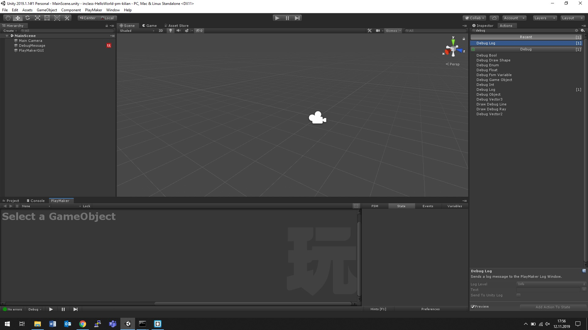

# inclass-HelloWorld-pm-kilian

### Project Description: 

The aim of this project is to:
+ practice the git/gitHub workflow and writing Readme Files. 
+ installing Playmaker
+ update .gitignore for Playmaker

### Development platform: 

Windows 10, Unity version 2019.1.14f1, Unity2018.3.Playmaker.1.9.0.p9

### Target platform: 

WebGL (RefRes: 1280x720 HD-720p)  

### Screenshots:

 